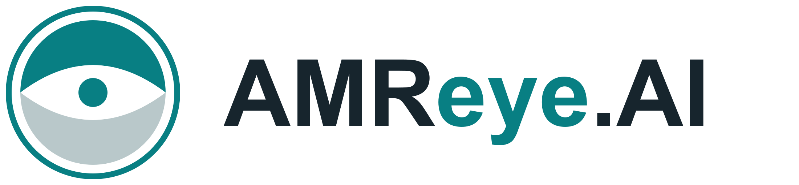
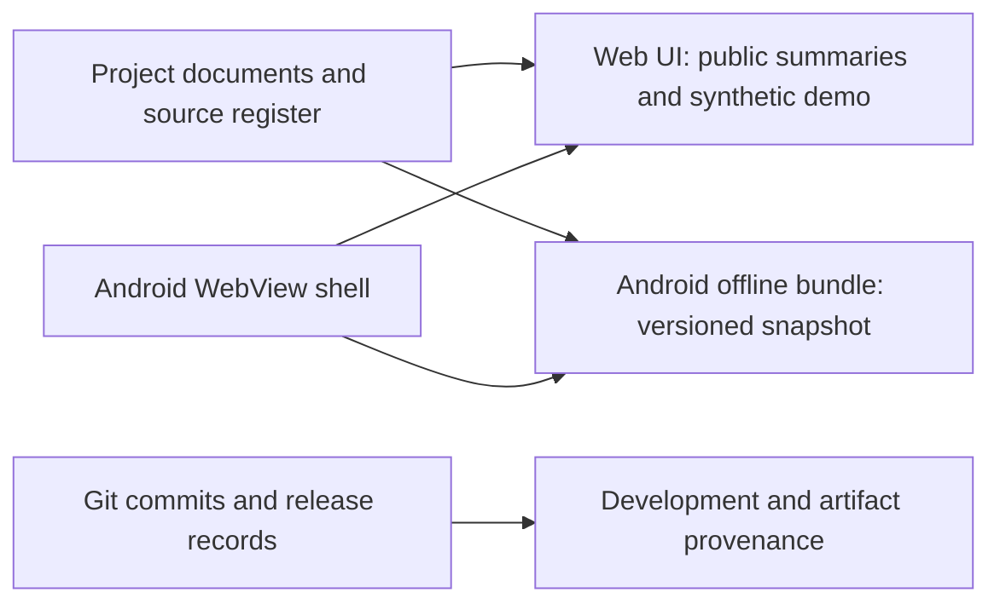

# AMReye.AI



[](https://github.com/Namdev90/amreye-ai/actions/workflows/ci.yml)
[Website](https://amreye.in) · [Android downloads](https://github.com/Namdev90/amreye-ai/releases) · [Development history](docs/development-history.md) · [Project documents](project-docs/README.md)

AMReye.AI explores image-assisted antimicrobial susceptibility measurement, traceable laboratory records, and microbiology research workflows. This repository brings together the website, Android app, research references, project documents, brand assets, and preserved development work.

**Stage:** research and prototype. The interactive AST examples use synthetic data and fictional interpretation profiles. Proposed hardware, clinical performance, and future research are not demonstrated product capabilities.

## Start here

| Goal | Destination |
| --- | --- |
| Explore the public project | [amreye.in](https://amreye.in) |
| Try the Android preview | [Releases and build limitations](docs/releases.md) |
| Read the project overview and detailed references | [Document guide](project-docs/README.md) |
| See what changed over time | [Development timeline](docs/development-history.md), [changelog](CHANGELOG.md), [commits](https://github.com/Namdev90/amreye-ai/commits/main/) |
| Run or contribute to the code | Quick start below, [testing](TESTING.md), [contributing](CONTRIBUTING.md) |
| Understand future priorities | [Roadmap](docs/roadmap.md) |
| Report a vulnerability privately | [Security policy](SECURITY.md) |

## What is in this repository?

| Path | Contents |
| --- | --- |
| `app/`, `components/`, `hooks/`, `lib/` | Web UI, public topic summaries, synthetic measurement and map logic |
| `public/` | Website assets; document downloads and raw chapter endpoints are retired |
| `android/` | Native Android **WebView** shell, Java source, and its bundled offline HTML/JavaScript library |
| `project-docs/` | Current main overview and seven supporting editable documents |
| `docs/` | Development history, architecture, release provenance, roadmap, and developer guides |
| `brand/`, `reference/` | Identity assets and concept references |
| `historical/` | Preserved earlier implementations, explicitly separated from the current app |
| `private/` | Legacy catalogue/reference inputs excluded from the website build; **publicly readable in this GitHub repository** |
| `scripts/`, `tests/`, `.github/` | Build helpers, tests, and contribution/verification workflows |
| `build/`, `worker/`, `db/`, `drizzle/` | Hosting integration source and retained optional database scaffolding |

The website and Android offline bundle are separate deliverables. Website changes do not automatically regenerate the APK's bundled content. Publishing documents to this repository also does not restore document hosting on the website.

## Run the website

Use Node.js 22.13 or newer and npm. CI uses Node.js 22 on Linux.

```sh
git clone https://github.com/Namdev90/amreye-ai.git
cd amreye-ai
npm ci
npm run dev
```

Open the local address printed by Vite. The anonymous public pages do not require a secret or a production database. Optional integrations are described by `.env.example`; keep real values in ignored local environment files.

```sh
npm test
```

This builds the site, starts a local Cloudflare-compatible preview on an available port, runs the tests, and closes that preview. To rerun the tests against an existing build, use `npm run test:runtime`. See [TESTING.md](TESTING.md) for scope and limits.

The canonical dependency installation uses `package-lock.json` and `npm ci`. The imported pnpm files are preserved for provenance; CI does not use them. Avoid mixing package managers in the same checkout.

For Android, follow [android/README.md](android/README.md). For the existing deployment integration, see [hosting notes](docs/hosting.md). The `build/` directory contains source code and must be retained.

## Architecture and evidence



The offline app includes an older 300-page compendium. The current document set contains a short main overview and seven detailed references; these are different editions. Read the [document guide](project-docs/README.md) before comparing their counts.

The `v1.5.5` Git tag identifies the original web release commit. Android source and the current document set were imported in later commits. The [release record](docs/releases.md) states the exact scope; this repository does not claim to recover edits that were never committed.

## Contributing and reuse

Use [issues](https://github.com/Namdev90/amreye-ai/issues) for reproducible bugs and focused proposals. Pull requests should explain the change and include relevant verification. Scientific or product claims need traceable evidence and an explicit maturity label.

Original software in this repository is available under the [MIT License](LICENSE). Brand assets, research documents, third-party material and other excluded content retain their stated rights; see [rights and attribution](docs/rights-and-attribution.md).

Maintained under [Namdev90](https://github.com/Namdev90). Project responsibilities and technical context are documented in the project overview.
